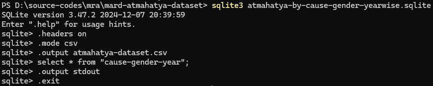

# Atmahatya Dataset (2002-2022)

[![CC BY 4.0][cc-by-shield]][cc-by]

- [Atmahatya Dataset (2002-2022)](#atmahatya-dataset-2002-2022)
  - [Citation](#citation)
  - [Description](#description)
  - [Important note](#important-note)
  - [Queries](#queries)
  - [How to get this data as a CSV file?](#how-to-get-this-data-as-a-csv-file)
  - [Acknowledgements](#acknowledgements)


This is a dataset (in SQLite DB format) that contains the extract of data published by [National Crime Records Bureau's ADSI PDF reports](https://www.ncrb.gov.in/accidental-deaths-suicides-in-india-adsi.html) from 2003-2022.

## Citation

```
@misc{vivganes_2025_atmahatya,
  author = {Vivek Ganesan<@vivek_ganesan>, Useless Millenial<@ricebagguy>},
  title = {{Atmahatya Dataset (2002-22)}},
  howpublished = {\url{https://github.com/vivganes/atmahatya-dataset}},
  note = {Accessed: yyyy-mm-dd}
  year = 2025
}
```

## Description
This dataset contains a single table `cause-gender-year` with the following schema

```sql
CREATE TABLE "cause-gender-year" (
    "Cause" TEXT,
    "year" TEXT,
    "Upto 14 Years Male" TEXT,
    "Upto 14 Years Female" TEXT,
    "Upto 14 Years Total" TEXT,
    "15-29 Years Male" TEXT,
    "15-29 Years Female" TEXT,
    "15-29 Years Total" TEXT,
    "<30 Years Male" TEXT,
    "<30 Years Female" TEXT,
    "<30 Years Total" TEXT,
    "30-44 Years Male" TEXT,
    "30-44 Years Female" TEXT,
    "30-44 Years Total" TEXT,
    "45-59 Years Male" TEXT,
    "45-59 Years Female" TEXT,
    "45-59 Years Total" TEXT,
    "60 Years & Above Male" TEXT,
    "60 Years & Above Female" TEXT,
    "60 Years & Above Total" TEXT,
    "Total Male" TEXT,
    "Total Female" TEXT,
    "Total" TEXT
)
```

The unique causes available are as follows.

**Note**: Some causes provided below are sub-category of others.  For example, "Non-settlement of marriage" is a sub-category of "Marriage Related Issues"

```
AIDS/STD
Bankruptcy or Indebtedness
Bankruptcy or Sudden change in Economic Status
Barrenness/Impotency (Not having Children)
Cancellation/Non-Settlement of Marriage
Cancer
Causes Not Known
Death of Dear Person
Divorce
Dowry Dispute
Dowry Related Issues
Drug Abuse/Addiction
Drug Abuse/Alcoholic Addiction
Extra Marital Affairs
Failure in Examination
Fall in Social Reputation
Family Problems
Ideological Causes/Hero Worshipping
Illegitimate Pregnancy
Illness
Illness (Total)
Impotency/Infertility
Insanity/Mental Illness
Love Affairs
Marriage Related Issues
Marriage Related Issues (Total)
Non Settlement of Marriage
Not having Children (Barrenness/Impotency)
Other Causes
Other Family Problems
Other Prolonged Illness
Others
Paralysis
Physical Abuse (Rape, Incest etc.)
Physical Abuse (Rape, Incest, etc.)
Physical Abuse (Rape, etc.)
Poverty
Professional/Career Problem
Property Dispute
Social Disrepute
Suspected/Illicit Relation
Total
Unemployment
```

## Important note

It is advisable to use the queries given below instead of composing your own query as each year's data and labels are a _little_ different.  Thanks to NCRB!

## Queries

Sample queries can be found in `queries.sql` file

## How to get this data as a CSV file?

1. Download [sqlite client](https://www.sqlite.org/download.html)
2. Extract the downloaded file into a folder
3. Open command prompt/terminal in the extracted folder
4. Type `sqlite3 atmahatya-by-cause-gender-yearwise.sqlite` and press enter
5. Then type the following commands
```
sqlite> .headers on
sqlite> .mode csv
sqlite> .output atmahatya-dataset.csv
sqlite> select * from "cause-gender-year";
sqlite> .output stdout
sqlite> .exit
```


## Acknowledgements

Big shout out to [Useless Millenial](https://x.com/ricebagguy) for their valuable contributions in extracting, verifying and packaging the data.

#JusticeIsDue


[cc-by]: http://creativecommons.org/licenses/by/4.0/
[cc-by-shield]: https://img.shields.io/badge/License-CC%20BY%204.0-lightgrey.svg